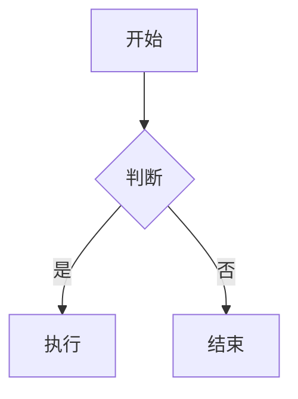

# 语雀 MCP API 使用指南（skylark_* 工具）

## 快速参考表

| 操作 | MCP 工具 | 关键参数 | 注意事项 |
|------|---------|---------|---------|
| 创建文档 | `skylark_doc_create` | book_id, title, body, format="markdown" | body 为 Markdown |
| 更新文档 | `skylark_doc_update` | doc_id, body, format="markdown" | **全文替换！必须先读后写** |
| 读取文档 | `skylark_doc_detail` | doc_id | 返回 YMD 格式 |
| 解析URL | `skylark_resolve_url` | url | 从 URL 获取 book_id/doc_id |
| 搜索文档 | `skylark_search` | q, scope(可选) | scope 为知识库 namespace |
| 知识库列表 | `skylark_user_book_list` | keyword(可选) | 获取 book_id |
| 文档列表 | `skylark_doc_list` | book_id | 获取 doc_id |
| 目录结构 | `skylark_book_toc` | book_id | 获取文档树 |
| 创建画板 | `skylark_resource_create` | resource_type="board", doc_id, type, dsl | type: flowchart/mindmap/architecturediagram |
| 更新画板 | `skylark_resource_update` | resource_type="board", doc_id, resource_id, text | 更新时用 **text** 参数（非 dsl）|
| 读取画板 | `skylark_resource_detail` | resource_type="board", doc_id, resource_id | 仅 Doc 类型文档可读 |

---

## 安全更新文档模板

`skylark_doc_update` 是**全文替换**，不是增量更新。直接写入会丢失已有内容。

**正确流程：**

```
步骤 1: skylark_doc_detail(doc_id=<doc-id>)
        → 获取完整 body（YMD 格式）

步骤 2: 在 body 中定位需要修改的部分，进行修改

步骤 3: skylark_doc_update(
          doc_id=<doc-id>,
          body=修改后的完整body,
          format="markdown"
        )
```

⚠️ **callout 读写不对称**：`doc_detail` 读取文档时，`<callout kind="warning">内容</callout>` 可能返回空 `{}`。如果直接把读取结果写回，会丢失 callout 文本。需将 `<callout kind="X">` 转换为 `:::colorN` 语法重写（kind 映射：info→1, success→2, warning→3, danger→4, tips→5）。

**快速创建文档模板：**

```
skylark_doc_create(
  book_id=<book-id>,
  title="文档标题",
  body="# 标题\n\n正文内容",
  format="markdown"
)
```

**从 URL 定位文档：**

```
步骤 1: skylark_resolve_url(url="https://yuque.antfin.com/xxx/yyy/zzz")
        → 获取 doc_id 和 book_id

步骤 2: 使用返回的 id 调用其他工具
```

---

## 详细说明

### 文档 CRUD

**创建文档** — `skylark_doc_create`
- 必填：`book_id`
- 可选：`title`（默认"无标题"）、`body`、`format`（markdown/lake/html）、`public`（0/1/2）
- format=markdown 时 body 传 Markdown 字符串
- format=html 且 type=HtmlDoc 时创建 HTML 文档（仅普通知识库支持）
- 创建数据表文档：传 `doc_type="Sheet"` + `sheet_markdown_body`

**读取文档** — `skylark_doc_detail`
- 必填：`doc_id`
- 返回内容为 YMD（Yuque Markdown）格式，包含语雀扩展语法
- YMD 中的画板引用格式：`board://<resource-id>`

**更新文档** — `skylark_doc_update`
- 必填：`doc_id`
- 可选：`title`、`body`、`format`、`public`
- **关键：body 是全文替换，不传 body 则不修改正文**
- 更新 Sheet：传 `doc_type="Sheet"` + `sheet_markdown_body`

**删除文档** — MCP 工具暂不支持删除

### 知识库与搜索

**知识库列表** — `skylark_user_book_list`
- 可选：`keyword`（模糊搜索）、`user_type`（User/Group）、`group_id`（团队ID）、`type`（Book/Thread）
- 返回 book_id、name、namespace 等信息

**文档列表** — `skylark_doc_list`
- 必填：`book_id`
- 支持分页：`offset`（默认0）、`limit`（默认100，最大100）

**搜索** — `skylark_search`
- 必填：`q`（关键词）
- 可选：`scope`（知识库 namespace，如 `<your-namespace>`）
- 不传 scope 默认搜索当前用户/团队范围

**目录结构** — `skylark_book_toc`
- 必填：`book_id`
- 返回文档树结构，包含 node_uuid、title、doc_id 等

### 画板资源（Board Resource）

画板是文档内的嵌入资源，支持流程图、思维导图、架构图。

**创建** — `skylark_resource_create`
```
skylark_resource_create(
  resource_type="board",
  doc_id=<doc-id>,
  type="flowchart",       # flowchart / mindmap / architecturediagram
  dsl="流程图DSL文本"      # 创建时用 dsl 参数
)
```

**更新** — `skylark_resource_update`
```
skylark_resource_update(
  resource_type="board",
  doc_id=<doc-id>,
  resource_id="<resource-id>",
  text="新的DSL文本"       # 更新时用 text 参数（不是 dsl！）
)
```

**读取** — `skylark_resource_detail`
```
skylark_resource_detail(
  resource_type="board",
  doc_id=<doc-id>,
  resource_id="<resource-id>"
)
```

### 高亮块语法

语雀支持 `:::colorN` 高亮块语法，在 `skylark_doc_update` 中有效：

```markdown
:::color1
蓝色信息框（info）
:::

:::color2
绿色成功框（success）
:::

:::color3
橙色警告框（warning）— 周报中最常用
:::

:::color4
红色危险框（danger）
:::

:::color5
灰色提示框（tips）
:::
```

> 读取文档时，`doc_detail` 返回的 `<callout kind="warning">` 对应 `:::color3`，kind 值 info/success/warning/danger/tips 分别对应 color1-5。

⚠️ `:::colorN` 前后必须有空行，否则不渲染。

### 表格换行

语雀 Markdown 表格内支持 `<br>` 换行：

```markdown
| 列A | 列B |
|-----|-----|
| 第一行<br>第二行 | 内容 |
```

---

## 核心陷阱与常见错误

### 1. skylark_doc_update 全文替换

**错误做法：**
```
skylark_doc_update(doc_id=<doc-id>, body="新增的一段内容")
```
这会用"新增的一段内容"**覆盖整篇文档**。

**正确做法：** 先读（doc_detail）→ 改 → 整体写回。

### 2. 创建画板用 dsl，更新画板用 text

**错误做法：**
```
skylark_resource_update(..., dsl="新内容")   # dsl 参数在 update 中无效
```

**正确做法：**
```
skylark_resource_create(..., dsl="内容")     # 创建用 dsl
skylark_resource_update(..., text="新内容")  # 更新用 text
```

### 3. Board 类型文档 vs Doc 中的 board resource

- `skylark_resource_detail` 只能读取 **Doc 类型文档中嵌入的 board resource**
- 如果文档本身是 Board 类型（知识库中直接创建的画板文档），resource_detail 无法读取其内容

### 4. skylark_search 的 scope 格式

- scope 是知识库的 **namespace**（如 `user/book-slug`），不是 book_id
- 不传 scope 时搜索用户有权限的全部范围

### 5. 同一文档多次 resource_create 会追加

- 对同一个 doc_id 多次调用 `skylark_resource_create` 会在文档中**追加**多个画板
- 不会覆盖已有画板
- 如需更新已有画板，使用 `skylark_resource_update`

### 6. 废弃工具

以下工具已废弃，请使用新版替代：

| 废弃工具 | 替代工具 |
|---------|---------|
| `skylark_user_doc_detail` | `skylark_doc_detail` |
| `skylark_user_doc_list` | `skylark_doc_list` |
| `skylark_user_doc_create` | `skylark_doc_create` |
| `skylark_user_doc_update` | `skylark_doc_update` |
| `skylark_user_book_update` | `skylark_book_update` |

### 7. MCP 无图片上传能力

MCP API 不支持上传图片到语雀文档。需要插入图片时，使用语雀 CLI 的 `--upload-images` 功能（参见 `cli-guide.md`）。

### 8. Mermaid 代码块

语雀支持 Mermaid 语法渲染，通过代码块插入：

````markdown

````

这在 `skylark_doc_create` 和 `skylark_doc_update` 中均有效。

### 9. 有毒标签（MCP API 写入时绝对不要用）

以下 YMD 标签通过 MCP API 的 Markdown body 写入时会产生问题：

- **有毒标签**（`<cardlink>`、`<mention>`）：不仅自身不渲染，还会**破坏后续所有段落**直到下一个块级元素，导致多段内容被合并成乱段
- **消除标签**（`<todo>`）：自身被静默消除，但不破坏后续内容

| 标签 | 预期功能 | 实际表现 | 替代方案 |
|------|---------|---------|---------|
| `<cardlink>` | 卡片式链接 | ❌ 有毒 | `[标题](url)` Markdown 链接 |
| `<mention>` | @人名 | ❌ 有毒 | `[@人名](https://yuque.antfin.com/<login>)` 视觉一致但不触发通知 |
| `<todo>` | 待办事项 | ❌ 被静默消除 | `- [ ]` / `- [x]` Markdown checkbox |

> 验证日期：2026-06-03。如需验证是否已修复，创建测试文档写入 `<cardlink href="url" title="test"/>`，检查后续段落是否正常。
