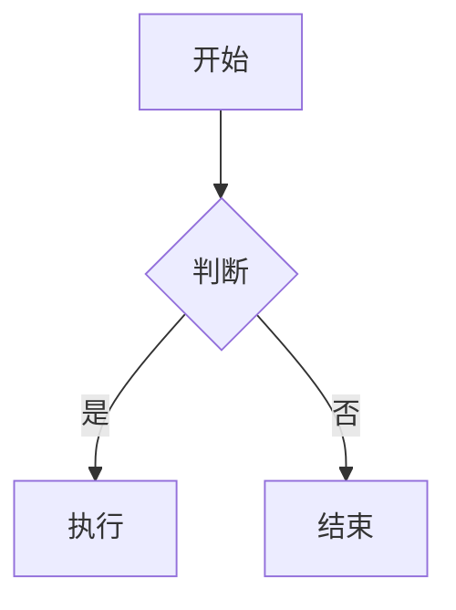

# YMD (语雀扩展 Markdown) 高级语法速查

## 快速模板

```markdown
<!-- 高亮块 -->
:::color3
**专项目标：** 这里是内容
:::

<!-- 彩色文字 -->
<font style="color:#DF2A3F;">红色重点</font>

<!-- 渐变文字 -->
<span textColor="#1677ff, #ff77ff">渐变色文字</span>

<!-- 上标/下标 -->
脚注<sup>1</sup>  化学式 H<sub>2</sub>O

<!-- 折叠 -->
<details>
  <summary>点击展开</summary>
  折叠内容
</details>

<!-- 多栏 -->
<columns>
  <column>左栏</column>
  <column>右栏</column>
</columns>

<!-- 标签卡片 -->
<label-card label="P0" colorIndex="1"/>

<!-- 语雀页面引用 -->
<page-title-card src="https://yuque.antfin.com/..." title="文档标题"/>
<page-card src="https://yuque.antfin.com/..." mode="card" title="文档标题"/>
<page-card src="https://yuque.antfin.com/..." mode="embed" title="文档标题"/>

<!-- 段落对齐/缩进 -->
居中文本。 {align="center"}
首行缩进。 {indent="true"}
```

---

## 详细说明

### 1. 高亮块 / Callout

**Markdown 简写**（推荐，MCP API 传入有效）：

```markdown
:::color3
**专项目标：** 内容文本
:::
```

**YMD 标签写法**：

```html
<callout kind="warning">内容文本</callout>
```

**颜色映射表**：

| kind 值 | Markdown 简写 | 效果 |
|---------|--------------|------|
| info | `:::color1` | 蓝色信息框 |
| success | `:::color2` | 绿色成功框 |
| warning | `:::color3` | 橙色警告框 |
| danger | `:::color4` | 红色危险框 |
| tips | `:::color5` | 灰色提示框 |

通过 MCP API `skylark_doc_update` 传入 `:::color3` 语法有效，可直接用于自动化写入。

---

### 2. 多栏布局

```html
<columns>
  <column>左栏内容</column>
  <column>右栏内容</column>
</columns>
```

- 支持 2 / 3 / 4 栏
- 每栏内支持任意 YMD 语法（列表、高亮块、表格等）

---

### 3. 折叠块

```html
<details>
  <summary>点击展开</summary>
  折叠内容，支持嵌套 Markdown
</details>
```

---

### 4. 文本格式增强

| 需求 | 语法 |
|------|------|
| 彩色文字 | `<font style="color:#DF2A3F;">红色</font>` |
| 等价写法 | `<span textColor="#DF2A3F">红色</span>` |
| 渐变文字 | `<span textColor="#1677ff, #ff77ff">渐变色</span>` |
| 背景色高亮 | `<span backgroundColor="#E8F7CF">绿色高亮</span>` |
| 下划线 | `<span underline="true">文字</span>` |
| 删除线 | `~~已废弃的文字~~` |
| 上标 | `文字<sup>1</sup>` |
| 下标 | `H<sub>2</sub>O` |

**常用颜色值**：

| 颜色 | HEX |
|------|-----|
| 红色 | #DF2A3F |
| 橙色 | #ED7B2F |
| 绿色 | #59A869 |
| 蓝色 | #4E91F7 |
| 灰色 | #8C8C8C |
| 绿色背景 | #E8F7CF |
| 黄色背景 | #FEF6D0 |
| 红色背景 | #FDDEDE |

---

### 5. 标签卡片

```html
<label-card label="P0" colorIndex="1"/>
```

| colorIndex | 颜色 |
|-----------|------|
| 1 | 红色 |
| 2 | 橙色 |
| 3 | 黄色 |
| 4 | 绿色 |
| 5 | 蓝色 |
| 6 | 紫色 |
| 7 | 灰色 |

---

### 6. 日历卡片

```html
<calendar-card currentDate="2026-06" colorIndex="0">
  <calendar-event id="evt1" title="评审会" start="2026-06-05" end="2026-06-05" colorIndex="1" desc="季度评审"/>
  <calendar-event id="evt2" title="冲刺周" start="2026-06-09" end="2026-06-13" colorIndex="3" desc=""/>
</calendar-card>
```

| 属性 | 说明 |
|------|------|
| `currentDate` | 日历显示的月份，格式 `YYYY-MM` |
| `colorIndex` | 颜色主题，0-5 |
| `start` / `end` | 事件日期范围，格式 `YYYY-MM-DD`，`end` 可省略（默认等于 `start`） |
| `title` / `desc` | 事件标题和描述 |
| `id` | 事件唯一标识 |

---

### 7. Mermaid / PlantUML 代码块

语雀支持以下代码块语言，自动渲染为图片：

- `mermaid` — 流程图、时序图、甘特图等
- `plantuml` — UML 各类图
- `flowchart` — 流程图
- `graphviz` — DOT 语言图

示例：

````markdown

````

---

### 8. 语雀页面引用

在文档中引用另一篇语雀文档，支持三种展示形态（参考：https://yuque.antfin.com/lark/ymd/bsgr09ttcssbieuc）：

#### 8a. 标题引用（行内链接）

```html
<page-title-card src="https://yuque.antfin.com/<namespace>/<slug>" title="文档标题"/>
```

在段落中渲染为可点击的超链接，适合轻量引用。

#### 8b. 卡片引用（块级卡片）

```html
<page-card src="https://yuque.antfin.com/<namespace>/<slug>" mode="card" title="文档标题"/>
```

渲染为带缩略图、标题、摘要的独立卡片块，适合资料汇总、方案索引。

#### 8c. 嵌入引用（iframe 嵌入）

```html
<page-card src="https://yuque.antfin.com/<namespace>/<slug>" mode="embed" title="文档标题"/>
```

在当前页面以 iframe 嵌入展示被引用文档的完整内容，读者无需跳转。

| 引用类型 | 标签 | 效果 |
|---------|------|------|
| 标题引用 | `<page-title-card>` | 行内超链接 |
| 卡片引用 | `<page-card mode="card">` | 块级卡片，带缩略图 |
| 嵌入引用 | `<page-card mode="embed">` | iframe 内嵌完整文档 |

> 三种引用方式均可通过 MCP API 写入，2026-06-03 实测验证通过。

---

### 9. 上标与下标

```markdown
脚注标记<sup>1</sup>

化学式 H<sub>2</sub>O

数学表达 x<sup>2</sup> + y<sup>2</sup> = z<sup>2</sup>
```

---

### 10. 段落对齐与缩进

```markdown
居中对齐。 {align="center"}

右对齐。 {align="right"}

两端对齐。 {align="justify"}

首行缩进段落。 {indent="true"}
```

支持的 align 值：`left`（默认）、`right`、`center`、`justify`。

> `{align="..."}` 和 `{indent="true"}` 也可用于标题和列表项。

---

### 11. 任务列表（待办勾选）

```markdown
- [ ] 待办事项
- [x] 已完成事项
- [ ] 另一个待办
```

标准 Markdown checkbox 语法，语雀完美支持，可在阅读模式下点击勾选。

> **不要用 `<todo>` 标签**——该标签通过 API 写入时会被解析器静默消除。

---

### 12. 文档链接

```markdown
[文档标题](https://yuque.antfin.com/<namespace>/<slug>)
```

使用标准 Markdown 链接即可。链接在语雀中渲染为蓝色可点击文本。

> **不要用 `<cardlink>` 标签**——该标签是"有毒标签"，不仅不渲染，还会破坏后续所有段落的结构。
>
> 如需更丰富的引用效果，使用 `<page-title-card>` 或 `<page-card>`（见第 8 节）。

---

### 13. @人名

**真实 mention card 不可通过 API 创建**——`<mention>` 标签是"有毒标签"，会破坏后续内容。

**视觉替代方案**（2026-06-03 验证通过）：

```markdown
[@人名](https://yuque.antfin.com/<login>)
```

渲染效果与真实 @mention 完全一致（绿色 @文字、可点击跳转用户主页）。

| | 真实 mention | 链接模拟 |
|---|---|---|
| 视觉效果 | 绿色 @文字 | 绿色 @文字（一致） |
| 点击行为 | 跳转用户主页 | 跳转用户主页（一致） |
| 触发通知 | ✅ | ❌ |
| "我被@"面板 | ✅ | ❌ |
| MCP API 可用 | ❌ | ✅ |

> 如需触发通知，只能在语雀编辑器中手动 @，或通过 Playwright 自动化输入 `@` 触发搜索面板。

---

## 🔴 有毒标签（MCP API 写入时绝对不要用）

以下标签通过 MCP API 的 Markdown body 写入时，不仅自身不渲染，还会**破坏后续所有段落**直到下一个块级元素（如 `<table>`），导致多个段落和标题被合并成一个乱段：

| 标签 | 预期功能 | 实际表现 | 替代方案 |
|------|---------|---------|---------|
| `<cardlink>` | 卡片式链接 | ❌ 有毒，破坏后续内容 | 用 `[标题](url)` Markdown 链接 |
| `<mention>` | @人名 | ❌ 有毒，破坏后续内容 | `[@人名](https://yuque.antfin.com/<login>)` 视觉一致，但不触发通知 |
| `<todo>` | 待办事项 | ❌ 被静默消除 | 用 `- [ ]` Markdown checkbox |

> 验证日期：2026-06-03。如需验证是否已修复，创建一个测试文档写入 `<cardlink href="url" title="test"/>`，检查后续段落是否正常渲染。

---

## 常见错误

| 错误现象 | 原因 | 解决方法 |
|---------|------|---------|
| 高亮块不渲染 | `:::` 前后缺少空行 | 确保 `:::colorN` 前后各有一个空行 |
| callout 内容为空 | API 读取 callout 返回 `{}` | 这是已知的读写不对称问题，创建有效但读取内容为空 |
| 彩色文字不生效 | 使用了 `color:red` 而非 HEX | 必须使用 HEX 颜色值如 `#DF2A3F` |
| 多栏布局不生效 | `<columns>` 标签拼写错误 | 检查标签名是否正确，注意是复数 `columns` |
| 标签卡片不显示 | 缺少自闭合斜杠 | 确保写成 `<label-card ... />` |
| doc_update 覆盖全文 | `skylark_doc_update` 是全文替换 | 先读取完整文档，修改后整体写回 |
| 折叠块内容丢失 | `<details>` 内嵌表格被解析器丢弃 | 折叠块内只放纯文本或列表，不要放表格（2026-06-05 验证） |
| 高亮块吞掉后续内容 | `:::colorN` 内嵌表格导致闭合边界溢出 | 表格不能嵌入 callout，callout 内只放文本和列表（2026-06-05 验证） |
| 多栏内表格丢失 | `<columns>` 内嵌表格被丢弃 | 表格不能嵌入 columns，表格必须放在文档顶层（2026-06-05 验证） |
